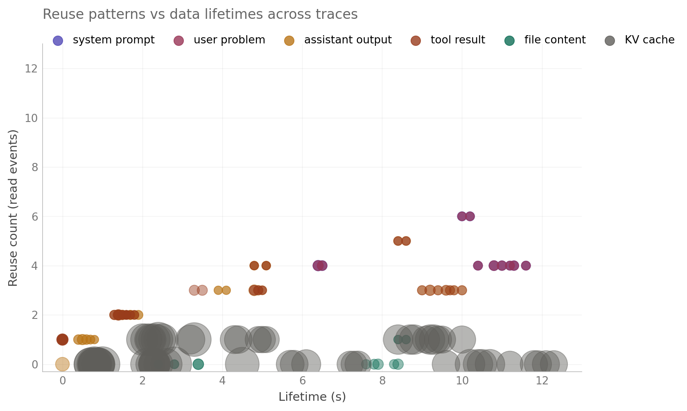
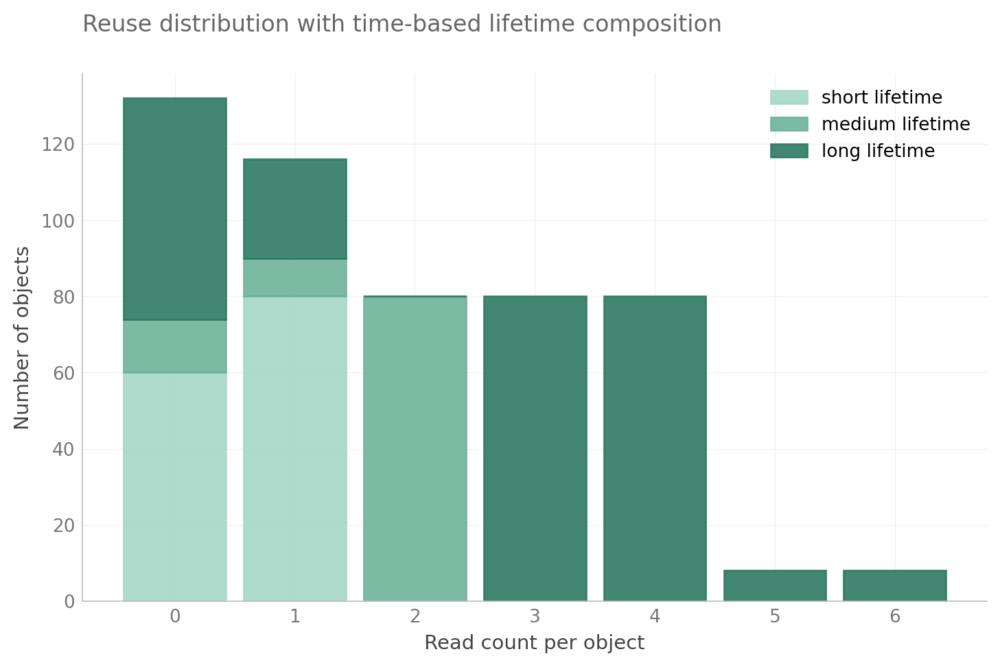
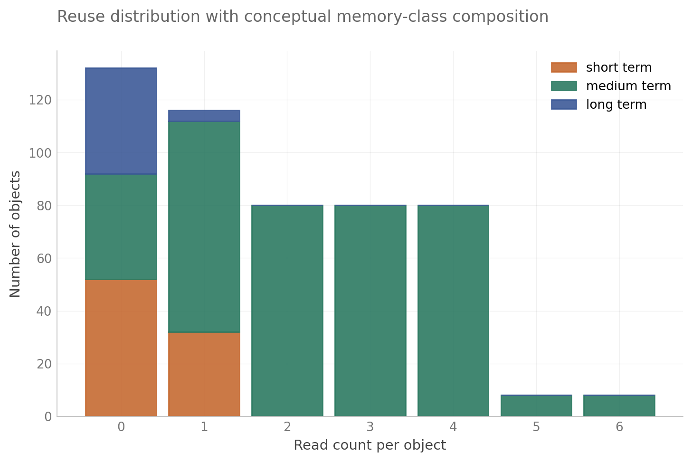

# EE 392C — Memory Lifetime Characterization of LLM Agent-Workflow Replays

**Authors:** Minseok Kim, Kristen Guernsey
**Course:** EE 392C — Differentiated Memory Systems, Stanford Spring 2026 (Professor Tambe)

<p align="center">
  
  <br>
  <em>KV cache and logical content live on opposite ends of the capacity-time vs logical-access axis.<br>
  This is the dichotomy that motivates a tiered mapping.</em>
</p>

## What this project is

We characterize memory access patterns in instrumented LLM workflow traces,
with the goal of informing how application-level data classes should map onto a
tiered (differentiated) memory system. The final artifact uses deterministic
multi-step **agent-workflow replays**: coding, search/retrieval, and
context-growth compaction. The headline is cross-workload variability: the same
semantic class can have different lifetime, reuse, token, KV, and duplication
behavior depending on workflow shape.

This is exploratory characterization, not a generalizable benchmark. Findings
are tightly coupled to Qwen2.5-Coder-7B-Instruct + vLLM and a small replay set.
The framing "scripted agent-workflow replays with agent-like prompt/tool
structure" is honest; "autonomous production agents broadly" is overclaiming.

## Stack

- **Final artifact:** `agent/run_final_v3.py`, six deterministic
  agent-workflow replay traces
- **Historical v2 batch:** Minimal ReAct-style harness (`agent/run_vllm.py`)
  with three tools (`read_file`, `write_file`, `run_tests`) and a fenced-JSON
  tool-call protocol
- **Engine:** vLLM 0.6.6.post1 + Qwen2.5-Coder-7B-Instruct
- **Compute:** RunPod RTX 4090 24GB (Ada sm_89)
- **Historical v2 tasks:** 2 hand-crafted fixtures (`hello_bug`, `recursion_bug`) ×
  5 sampling temperatures × 2 cache modes (prefix caching on/off) = 20 traces

## Telemetry — logical layer

JSONL events from the workflow/replay code:

```
{schema_version, ts, step, phase, object_id, logical_id, repr_type, size_bytes, op}
```

Schema v3 is additive over v2 (runtime validation in `agent/tracer.py`). Each
event records one create / read / mutate / free on a logical object across
representations such as text, tokens, and analytically projected KV. v3 can also
carry `semantic_type`, `source`, token-span offsets, token count, and confidence.

What we are **not** tracking: Nsight Compute kernel counters, DRAM bandwidth
aggregates, SRAM/L1/L2 behavior, actual HBM residency, or cross-tier migration.
The tier mapping is *prescriptive* from logical semantic/token/KV observations,
not measured physical placement.

## Headline metrics

1. **Lifetime** — task-bounded logical presence (create → last access)
2. **Reuse count** — accesses after creation
3. **Memory footprint over time** — bytes per category, time series
4. **Byte-seconds** — size × lifetime (capacity-time pressure)
5. **Per-category logical access-vs-capacity split** — logical read events vs byte-seconds
   per category (this is the novel angle vs GainSight: GainSight measures
   activation lifetime within a single forward pass; we measure logical-object
   lifetime across workflow steps)

## Headline findings

### Historical v2 findings

The original v2 batch remains useful background, but the final report should use
fresh v3 traces for cross-workload claims. v2 duplication factors are historical
only: v2 assigned KV logical IDs at full-prompt granularity, so cross-representation
duplication is not meaningfully measurable from that batch.

### 1. Two object populations, six orders of magnitude apart in size


KV-cache blocks (10–50 MB, gray, top cluster) and logical content (10 B–1 KB,
colored, bottom cluster) live in disjoint regions of the size–lifetime plane.
They will never be well-served by a single memory tier.

### 2. KV cache dominates byte-seconds but not bandwidth


Across one task (`hello_bug`, cache_on, t=0.0), live KV grows step-wise to
42 MB while live logical content stays under 2 KB. Aggregated across all 20
traces (chart at top of README), KV holds **99.994% of byte-seconds but only
3.3% of logical read events**; logical content inverts that ratio. This is not
a hardware bandwidth measurement.

### 3. Proposed three-tier mapping


Anchored to the historical 20-trace v2 dataset. Caveat: tier labels are
prescriptive from logical traces, not measured SRAM/HBM residency.

### 4. Reuse and lifetime are coupled, but by category



The reuse-lifetime scatter shows that "hot" objects are not always large, and
large objects are not always hot. In memory-system terms: small/high-reuse
state (system prompt, current user/problem text, frequently revisited tool and
assistant snippets) wants high-bandwidth volatile tiers (SRAM/HBM), while
large/lower-reuse KV regions want capacity-oriented tiers (HBM/DDR, and
eventually CXL-attached capacity). This is a placement prescription, not a
measured SRAM/HBM residency result.

### 5. Reuse distribution with time-based lifetime buckets



Lifetime buckets used in this figure are: **short** = [0, 1) seconds,
**medium** = [1, 3) seconds, **long** = [3, inf) seconds.

Stacking reuse counts by lifetime bucket makes the retention requirement
explicit: most reused objects are short/medium lived, so low-latency volatile
memory carries the critical path. Longer-lived low-reuse data is a better fit
for larger, cheaper tiers (DDR or emerging NVM such as MRAM/RRAM if endurance
and write-latency constraints are acceptable), where non-volatility and
capacity matter more than peak bandwidth.

### 6. Reuse distribution with conceptual memory classes



This view uses the systems-oriented taxonomy directly: short-term = `kv_cache`,
medium-term = `system_prompt` + `user_problem` + `assistant_output` +
`tool_result`, long-term = `file_content`. It is a role-based mapping rather
than a pure time-threshold mapping, and therefore better aligned with
differentiated-tier design choices (bandwidth-critical volatile tiers vs
capacity/retention-oriented tiers).

Model weights are part of the long-term memory conceptually, but are not
represented as per-object JSONL events in the current tracer and therefore do
not appear in this figure.

## Repo layout

```
agent/         Agent code + JSONL tracer + matrix runner
serving/       vLLM launch helpers
validation/    Synthetic-agent test (tracer correctness contract)
analysis/      Trace parsing + per-category breakdown
analysis_out/  Generated summary CSVs
traces/        Committed: traces/batch_v2/ (20 JSONL traces)
figures/       Paper-ready figures + standalone SVGs
tasks/         Task fixtures (hello_bug, recursion_bug)
```

## Status (May 28, 2026)

- Tracer v3 additive schema + final-v3 replay runner: in local implementation
- 20-trace batch + summary CSV + per-category CSV: in repo
- Historical paper-ready v2 figures (`figures/fig1`–`fig7`): in repo
- Final-v3 traces should be regenerated under `traces/final_v3/`
- Optional system telemetry is auxiliary; final claims should not depend on it
- Final presentation + report: W5–W6

## Final v3 artifact path

The final report artifact should use fresh schema-v3 traces in
`traces/final_v3/`, not the historical `traces/batch_v2/` batch. The v3 path
profiles three structurally distinct scripted agent-workflow replays with two
contrast traces each:

- `coding_agent`: prefix-cache on (matched default) vs off
- `search_agent`: targeted retrieval (matched default) vs broad/noisy retrieval
- `compaction_agent`: compaction on (matched default) vs off

The second trace in each pair is an ablation, not a replicate. Do not report CIs
or significance tests from these six traces. The search and compaction replays
expand small seed fixtures deterministically at runtime so prompt shape is large
enough to stress retrieval/compaction without storing bulky synthetic files.

```
python3 -m agent.run_final_v3 --all --out-dir traces/final_v3 \
  --system-telemetry-dir traces/final_v3_system
python3 -m validation.validate_final_v3 traces/final_v3/*.jsonl
python3 -m analysis.final_v3 traces/final_v3
```

For local validation without vLLM:

```
python3 -m agent.run_final_v3 --all --dry-run --out-dir /tmp/final_v3_dryrun
python3 -m validation.validate_final_v3 /tmp/final_v3_dryrun/*.jsonl
```

Dry-run traces validate schema and attribution plumbing only. Their
byte-seconds are dominated by local tracing overhead and must not be used for
paper figures or cross-condition claims.

Schema v3 is additive: all v2 lifecycle fields remain, and events can also
carry `semantic_type`, `source`, token-span offsets, token count, and confidence.
KV pressure is a GQA-aware analytical projection derived from model config. KV
span byte-seconds are bounded at the next prefill boundary. Cache-adjusted KV
uses vLLM cached-token counters when available and assumes cached prefixes are
contiguous leading spans. Actual physical HBM residency is not claimed.

## Key dates

| Milestone          | Date           |
| ------------------ | -------------- |
| Lightning pitch    | May 13, 2026 (done) |
| Final presentation | June 1–3, 2026 |
| Final report       | June 8, 2026   |

## Anchor papers

- **GainSight** (arXiv 2504.14866) — methodology anchor for data-lifetime
  profiling, applied at activation/within-pass granularity
- **ReCA** — dual-memory framework for agentic systems (motivates the
  long-term/short-term split we map to Tiers 2/3)
- **DualPath** — multi-turn agent memory bottleneck

See `DECISIONS.md` for locked-in technical decisions and `SETUP.md` for the
bring-up runbook.
