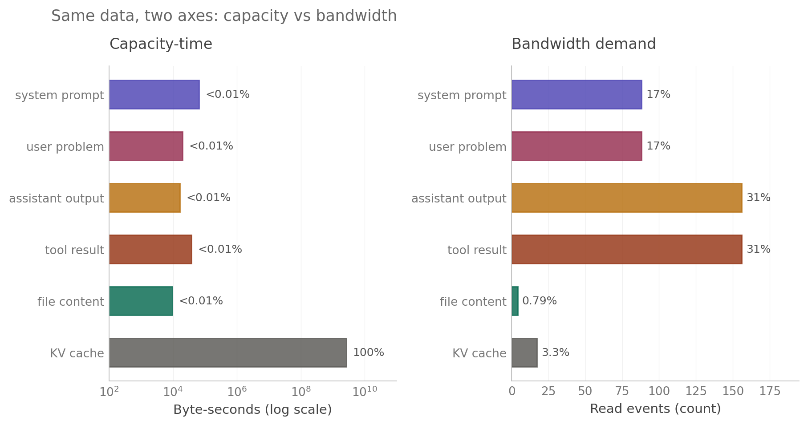
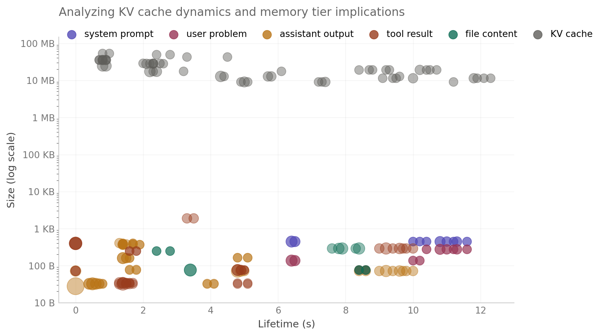
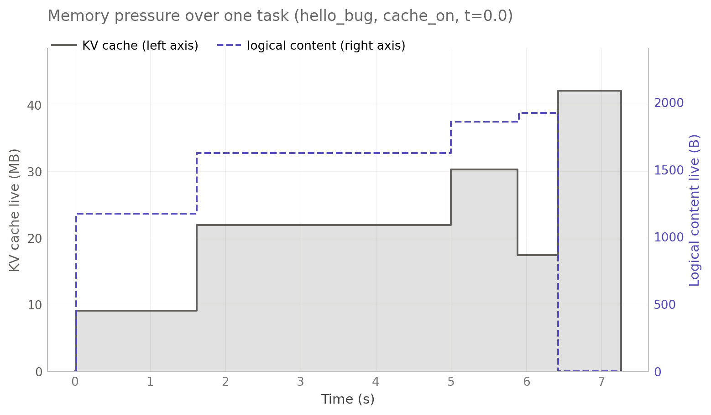

# EE 392C — Memory Lifetime Characterization of Coding-Agent Inference

**Authors:** Minseok Kim, Kristen Guernsey
**Course:** EE 392C — Differentiated Memory Systems, Stanford Spring 2026 (Professor Tambe)

<p align="center">
  
  <br>
  <em>KV cache and logical content live on opposite ends of the capacity-vs-bandwidth axis.<br>
  This is the dichotomy that motivates a tiered mapping.</em>
</p>

## What this project is

We characterize memory access patterns in a small, instrumented coding-agent
inference workload, with the goal of informing how application-level data
classes should map onto a tiered (differentiated) memory system. The work
measures lifetime, reuse, footprint, and per-category bandwidth-vs-capacity
demand of agent state, and proposes a prescriptive tier mapping based on
observed patterns.

This is exploratory characterization, not a generalizable benchmark. Findings
are tightly coupled to our specific configuration (Qwen-Coder 7B + vLLM 0.6.6
+ a minimal ReAct-style harness) and a small task set; the framing
"a representative coding-agent configuration" is honest, "coding-agent
inference broadly" is overclaiming.

## Stack

- **Agent:** Minimal ReAct-style harness (~140 LOC, `agent/run_vllm.py`)
  with three tools (`read_file`, `write_file`, `run_tests`) and a
  fenced-JSON tool-call protocol
- **Engine:** vLLM 0.6.6.post1 + Qwen2.5-Coder-7B-Instruct
- **Compute:** RunPod L4 24GB (Ada sm_89)
- **Tasks:** 2 hand-crafted fixtures (`hello_bug`, `recursion_bug`) ×
  5 sampling temperatures × 2 cache modes (prefix caching on/off) = 20 traces

## Telemetry — logical layer

JSONL events from the agent code:

```
{ts, step, phase, object_id, logical_id, repr_type, size_bytes, op}
```

Schema is v2 (runtime enum validation in `agent/tracer.py`). Each event
records one create / read / mutate / free on a logical object across three
representations: text, tokens, kv_estimated.

What we are **not** tracking: Nsight Compute kernel counters, DRAM bandwidth
aggregates, HBM internals, cross-tier offload dynamics. The tier mapping is
*prescriptive* (argued from logical access patterns + published memory-tech
specs), not measured.

## Headline metrics

1. **Lifetime** — task-bounded logical presence (create → last access)
2. **Reuse count** — accesses after creation
3. **Memory footprint over time** — bytes per category, time series
4. **Byte-seconds** — size × lifetime (capacity-time pressure)
5. **Per-category bandwidth-vs-capacity split** — read events vs byte-seconds
   per category (this is the novel angle vs GainSight: GainSight measures
   activation lifetime within a single forward pass; we measure logical-object
   lifetime across agent steps)

## Headline findings

### 1. Two object populations, six orders of magnitude apart in size



KV-cache blocks (10–50 MB, gray, top cluster) and logical content (10 B–1 KB,
colored, bottom cluster) live in disjoint regions of the size–lifetime plane.
They will never be well-served by a single memory tier.

### 2. KV cache dominates byte-seconds but not bandwidth



Across one task (`hello_bug`, cache_on, t=0.0), live KV grows step-wise to
42 MB while live logical content stays under 2 KB. Aggregated across all 20
traces (chart at top of README), KV holds **99.994% of byte-seconds but only
3.3% of read events**; logical content inverts that ratio.

### 3. Proposed three-tier mapping


Anchored to the 20-trace dataset. Caveat: traces are 4–6 steps; the
Tier-3 capacity argument scales with step count (20+ step agents amplify
it considerably).

## Repo layout

```
agent/         Agent code + JSONL tracer + matrix runner
serving/       vLLM launch helpers
validation/    Synthetic-agent test (tracer correctness contract)
analysis/      Trace parsing + per-category breakdown
analysis_out/  Generated summary CSVs
traces/        Committed: traces/batch_v2/ (20 JSONL traces)
figures/       Paper-ready figures + standalone SVGs
tasks/         Task fixtures (hello_bug, recursion_bug)
```

## Status (May 20, 2026)

- Tracer v2 + matrix runner + lifetime/per-category analysis: done
- 20-trace batch + summary CSV + per-category CSV: in repo
- Paper-ready figures (`figures/fig1`–`fig4`): in repo
- Cross-step KV byte attribution (decompose per-step KV into
  system + history + new): pending (W4)
- Final presentation + report: W5–W6

## Key dates

| Milestone          | Date           |
| ------------------ | -------------- |
| Lightning pitch    | May 13, 2026 (done) |
| Final presentation | June 1–3, 2026 |
| Final report       | June 8, 2026   |

## Anchor papers

- **GainSight** (arXiv 2504.14866) — methodology anchor for data-lifetime
  profiling, applied at activation/within-pass granularity
- **ReCA** — dual-memory framework for agentic systems (motivates the
  long-term/short-term split we map to Tiers 2/3)
- **DualPath** — multi-turn agent memory bottleneck

See `DECISIONS.md` for locked-in technical decisions and `SETUP.md` for the
bring-up runbook.
