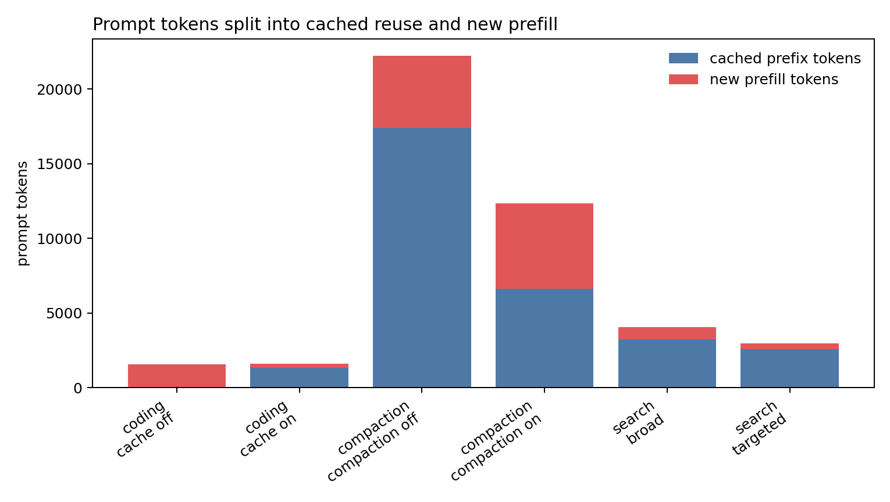
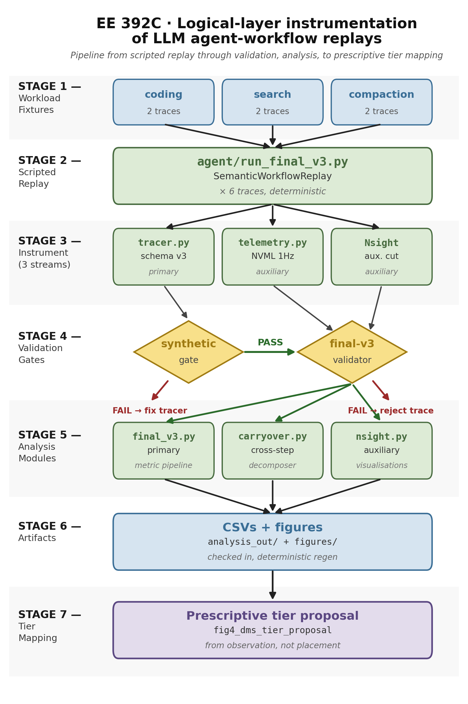
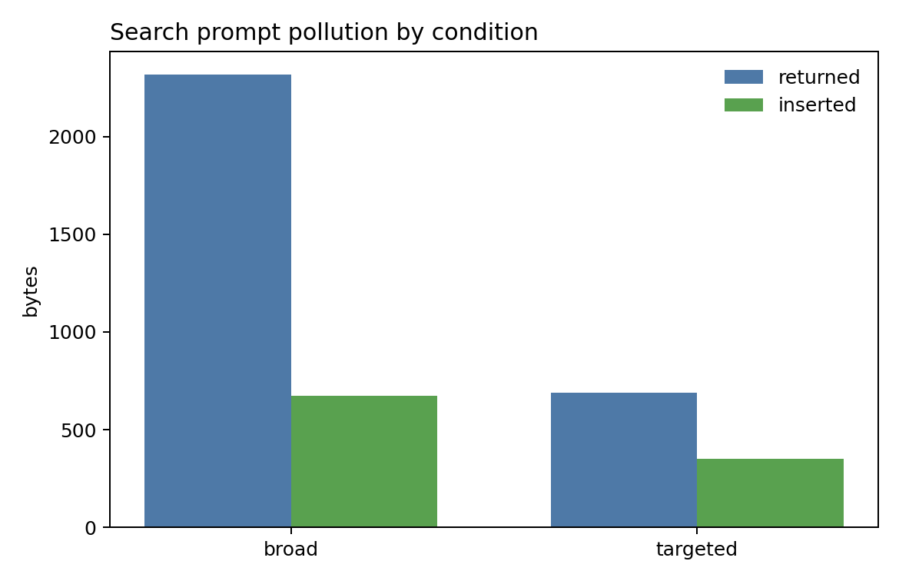
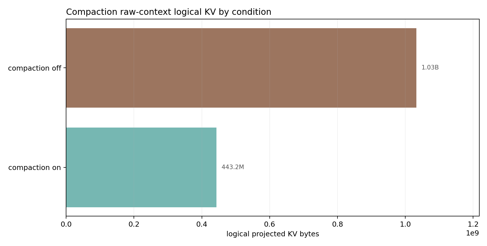
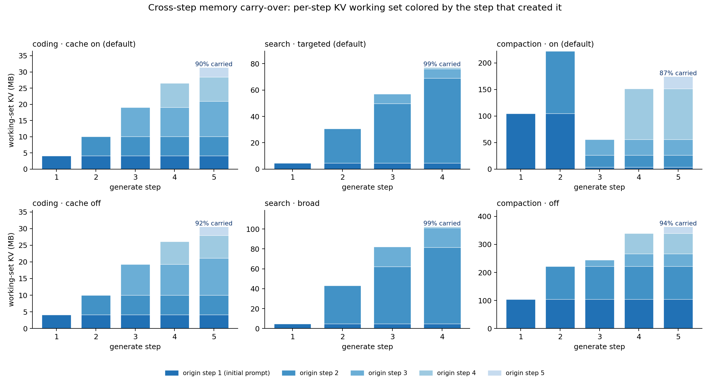
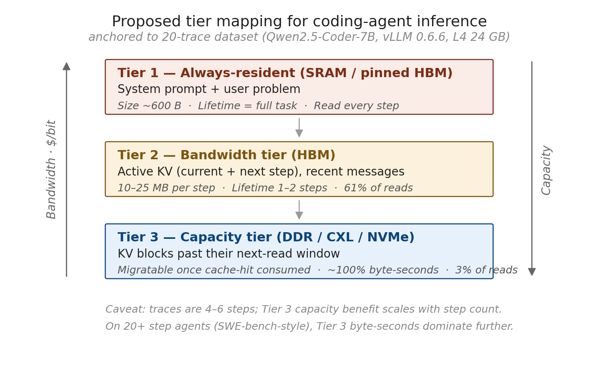

# EE 392C — Memory-Lifetime Characterization of LLM Agent-Workflow Replays

**Authors:** Minseok Kim · Kristen Guernsey
**Course:** EE 392C — Differentiated Memory Systems · Stanford, Spring 2026 (Prof. Tambe)

<p align="center">
  
  <br>
  <em>Across six H100 traces, workflow structure decides where the agent pays
  new prefill work versus reusing cached-prefix KV.</em>
</p>

## What this is

We profile **how an LLM agent uses memory across the many steps of a task**, then
use those measurements to recommend which application-level data classes belong
in which tier of a **differentiated (tiered) memory system (DMS)**.

The artifact is an **experimental framework + analysis pipeline** — not a
simulator or hardware model. It instruments deterministic **agent-workflow
replays** (coding, search/retrieval, context-growth compaction) running on real
hardware, records every logical memory event, and derives a prescriptive tier
mapping from the patterns.

**The novel angle vs. [GainSight](https://arxiv.org/abs/2504.14866):** GainSight
profiles data lifetime *within a single forward pass*; we profile logical-object
lifetime *across agent steps* (**cross-step**). The headline is that the same
semantic class behaves very differently — in lifetime, reuse, KV pressure,
duplication, and cross-step carry-over — depending on workflow shape.

> **Scope honesty.** This is exploratory characterization, tightly coupled to
> Qwen2.5-Coder-7B-Instruct + vLLM and a small replay set. "Scripted
> agent-workflow replays with agent-like prompt/tool structure" is accurate;
> "autonomous production agents broadly" would be overclaiming.

## Methodology

<p align="center">
  
</p>

The pipeline runs left-to-right: **scripted workload fixtures → deterministic
replay runner (`agent/run_final_v3.py`) → three instrumentation streams (logical
tracer, system telemetry, auxiliary Nsight) → validation gates (synthetic oracle
+ final-v3 validator) → analysis modules → prescriptive tier mapping.**

Tool *choices* are hard-scripted so the memory shape is repeatable, but the LLM
*text* is genuinely generated and fed back into history. Regenerate the figure
with `python3 -m analysis.methodology`.

**Stack**

- **Final artifact:** `agent/run_final_v3.py` — six deterministic replay traces
- **Engine / model:** vLLM 0.10.2 + Qwen2.5-Coder-7B-Instruct (in-process `LLM`)
- **Compute:** RunPod NVIDIA H100 80GB HBM3, bf16, `temperature 0`, `seed 42`
- **Workloads:** 3 families × 2 contrast conditions = **6 traces**
  - `coding_agent` — read/edit/test debug loop, prefix caching **on** vs **off**
  - `search_agent` — grep-and-select retrieval, **targeted** vs **broad**
  - `compaction_agent` — log ingest + summarize, compaction **on** vs **off**
- **Historical v2 batch (background):** ReAct-style harness (`agent/run_vllm.py`)
  with three tools, 2 fixtures × 5 temperatures × 2 cache modes = 20 traces

## What the tracer records (logical layer)

One JSONL event per memory operation (schema v3, validated in `agent/tracer.py`):

```
{schema_version, ts, step, phase, object_id, logical_id, repr_type, size_bytes, op}
```

- **`op`** ∈ create / read / mutate / free — the lifecycle of one object
- **`logical_id`** — content hash; same content ⇒ same id, an edit ⇒ new id
- **`repr_type`** ∈ text / tokens / kv_estimated — the same object in each form
- **`semantic_type`** — the application class (system_prompt, raw_context, …)

v3 adds optional `semantic_type`, `source`, token-span offsets, token count, and
confidence on top of the v2 lifecycle fields.

## Findings — six H100 traces

These are paired *mechanism contrasts*, not replicates, so the framing is
mechanism-based characterization (no confidence intervals).

### 1. Prefix caching turns repeated coding context into cached-prefix reuse


Cache-on and cache-off have nearly identical total prompt tokens (1,590 vs
1,571), but with prefix caching vLLM reports **1,344 cached tokens and only 246
new prefill tokens**. Cache-adjusted new KV falls from 90,087,424 B to
14,106,624 B — an **84.3% reduction**. Cache-off has zero KV-reuse events.

### 2. Retrieval selectivity, not scan volume, drives prompt pollution



Both search traces scan the **same** expanded corpus (88,372 B). What differs is
what enters prompt history: broad returns 2,318 B / inserts 672 B, while targeted
returns 691 B / inserts 350 B. Broad `search_result` logical KV is **3.22×**
targeted. (The scan-volume proxy lives only in `search_funnel.csv` and is
excluded from the live-object summaries.)

### 3. Compaction cuts retained context pressure, with a reuse tradeoff



Both compaction traces ingest the same 18,602 B of raw log context. Compaction
adds a 513 B summary, demotes the earlier raw context (`op=free`), and cuts
raw-context logical KV from **1.032 GB to 443 MB**. The tradeoff: compaction-on
has fewer total prompt tokens (12,364 vs 22,234) but **more** new prefill tokens
(5,740 vs 4,826) because inserting a summary disrupts the long cached prefix.

### 4. Agent workflows are carry-over-dominated across steps



At every generate step the runner re-reads and re-projects every still-active
object, so the per-step KV working set splits into newly-prefilled bytes versus
**carried-from-an-earlier-step** bytes (`analysis/carryover.py`). By the final
step of every default trace, **~87–99% of the projected-KV working set
originates in an earlier step** rather than being new work. **Compaction is the
only mechanism that resets this mid-task** — compaction-on falls to 46% carried
at the step-3 demotion (and 37% at step 4) before recovering, while every other
trace ends its task above 90% carried. This is the cross-step view GainSight's
within-pass profiling cannot see, and it directly motivates caching reused
prefixes and demoting bulky low-reuse context.

### Cross-cutting: capacity-time and reuse are *decoupled*

In the compaction-off trace, `raw_context` and `assistant_history` both record
30 logical read events, yet `raw_context` holds **4.6× the byte-seconds**
(size × lifetime; 5.7× on the repo-preferred step-normalized byte-steps axis).
Neither size, lifetime, nor reuse *alone* separates the classes — placement
must key on **(capacity-time × reuse)** jointly. That decoupling is what makes
a tiered mapping non-trivial.

Kristen's retention/reuse diagnostics (`semantic_retention_by_class`,
`reuse_interval_by_workload`, `workload_retention_composition`,
`lifetime_reuse`, `lifetime_buckets_by_workload`, `step_duration_by_workload`)
slice the same behavior by semantic class.

## Tier-mapping implication

<p align="center">
  
</p>

The traces do **not** measure physical placement. They support a *prescriptive*
mapping keyed on (capacity-time, reuse):

- **Tier 1 — resident, low-latency:** small, high-reuse scaffolding
  (`system_prompt`, `plan_state`, `compacted_summary`)
- **Tier 2 — bandwidth:** active KV and recent context
- **Tier 3 — capacity, cheap:** bulky, low-reuse retained context
  (`raw_context`, broad `search_result`)

## Headline metrics

1. **Lifetime** — task-bounded logical presence (create → last access); reported
   step-normalized *and* in seconds (prefer steps for cross-workload comparison)
2. **Reuse count** — `logical_read_events`: representation-level logical access
   events (a logical access-intensity signal, **not** a hardware
   memory-transaction count). `semantic_summary.csv` decomposes it into
   `prompt_construction_reads` (text/token re-reads while assembling each
   prompt) and `cached_prefix_kv_reads` (engine-reported cached-prefix KV
   reuse, present only when prefix caching is on)
3. **Byte-seconds** — size × lifetime (capacity-time pressure)
4. **KV pressure** — logical / cached-reuse / cache-adjusted-new KV per class
5. **Duplication** — bytes held vs. unique logical bytes across representations
6. **Cross-step carry-over** — per-step KV split into new-prefill vs carried
   (`analysis/carryover.py` → `carryover.csv`)

## Reproduce

Run the gates first, then a single real trace to confirm cached-token extraction
is not `unavailable`, then the full sweep:

```bash
python3 -m validation.synthetic --output /tmp/synthetic_v3.jsonl
python3 -m validation.assert_synthetic /tmp/synthetic_v3.jsonl
python3 -m validation.assert_validate_final_v3

python3 -m agent.run_final_v3 --all --out-dir traces/final_v3 \
  --system-telemetry-dir traces/final_v3_system
python3 -m validation.validate_final_v3 traces/final_v3/*.jsonl
python3 -m analysis.final_v3 traces/final_v3
```

Local validation without vLLM (schema + attribution plumbing only):

```bash
python3 -m agent.run_final_v3 --all --dry-run --out-dir /tmp/final_v3_dryrun
python3 -m validation.validate_final_v3 /tmp/final_v3_dryrun/*.jsonl
```

Dry-run byte-seconds are dominated by local tracing overhead and **must not** be
used for paper figures or cross-condition claims.

## Scope & assumptions

- **KV is analytical, not measured.** A GQA-aware projection from model config:
  `2 × 28 layers × 4 KV-heads × 128 head-dim × 2 bytes = 57,344 B/token`. KV span
  byte-seconds are bounded at the next prefill boundary, not task end.
- **Cached-token reconciliation is an availability/count check**, not independent
  semantic-attribution ground truth: it confirms `RequestOutput.num_cached_tokens`
  is present and consistent with the per-span tiling.
- **Placement is prescriptive**, from logical semantic/token/KV observations — not
  measured physical residency or migration.
- **Not tracked:** Nsight Compute kernel counters, DRAM bandwidth, SRAM/L1/L2,
  actual HBM residency, cross-tier migration. (Auxiliary **Nsight Systems** only,
  analyzed by `analysis/nsight.py` — NVTX phase timeline + ~86% GEMM kernel mix —
  validates that phase markers map to real GPU work; it is a droppable cut.)
- **No statistics.** Six traces, no within-condition replication → no CIs or
  significance tests.

## Repo layout

```
agent/         Replay runner + JSONL tracer (+ historical v2 harness/runner)
serving/       vLLM launch + system/Nsight telemetry helpers
validation/    Synthetic oracle (tracer contract) + final-v3 validator
analysis/      Trace parsing, per-category, carry-over, Nsight, methodology figure
analysis_out/  Generated summary CSVs
traces/        Historical v2 batch + final-v3 H100 trace artifacts
figures/       Paper-ready figures (PNG + SVG)
tasks/         Fixtures: hello_bug, recursion_bug, search_agent, compaction_agent
```

## Status (June 10, 2026)

- Final presentation delivered June 1–3; final report and artifact submitted
  June 8; post-submission audit pass applied June 10 (validator hardening,
  figure/doc errata — no changes to the official traces or headline numbers)
- Final-v3 H100 sweep: six real vLLM traces in `traces/final_v3/`, passing
  `validation.validate_final_v3`; validator regression check passes
- Analysis CSVs/figures generated under `analysis_out/final_v3/` and
  `figures/final_v3/`; cross-step carry-over and Nsight analyses added
- System telemetry collected (`traces/final_v3_system/`); auxiliary and not
  relied on for final claims
- Repo cleanup: removed unused LangGraph/transformers stubs and their pins;
  `SETUP.md` marks the `vllm serve` path as an optional smoke test (the runner
  uses in-process `vllm.LLM`)

## Historical v2 background

The original 20-trace v2 batch is useful background but assigned KV logical IDs at
full-prompt granularity, so cross-representation duplication is not meaningfully
measurable from it — use the fresh v3 traces for cross-workload claims. The
durable v2 lesson is the access/capacity split: KV dominates capacity-time while
prompt/tool objects dominate logical read events
(`figures/fig1_lifetime_size_scatter.png`,
`figures/fig3_capacity_vs_logical_reads.png`).

## References

- **GainSight** (arXiv 2504.14866) — data-lifetime profiling at activation /
  within-pass granularity (our methodology anchor)
- **ReCA** — dual-memory framework for agentic systems (short/long-term split)
- **DualPath** — multi-turn agent memory bottleneck

See `DECISIONS.md` for locked-in technical decisions and `SETUP.md` for the
RunPod bring-up runbook.
