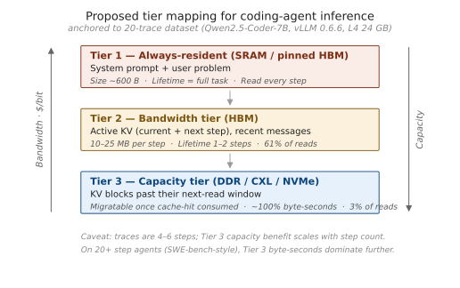

# EE 392C — Memory Lifetime Characterization of LLM Agent-Workflow Replays

**Authors:** Minseok Kim and Kristen Guernsey
**Course:** EE 392C — Differentiated Memory Systems, Stanford Spring 2026 (Professor Tambe)

<p align="center">
  
  <br>
  <em>Final-v3 H100 traces expose where workflow structure pays new prefill work<br>
  versus reusing cached-prefix KV.</em>
</p>

## What this project is

We characterize memory access patterns in instrumented LLM workflow traces,
with the goal of informing how application-level data classes should map onto a
tiered (differentiated) memory system. The final artifact uses deterministic
multi-step **agent-workflow replays**: coding, search/retrieval, and
context-growth compaction. The headline is cross-workload variability: the same
semantic class can have different lifetime, reuse, token, KV, duplication, and
cross-step carry-over behavior depending on workflow shape.

This is exploratory characterization, not a generalizable benchmark. Findings
are tightly coupled to Qwen2.5-Coder-7B-Instruct + vLLM and a small replay set.
The framing "scripted agent-workflow replays with agent-like prompt/tool
structure" is honest; "autonomous production agents broadly" is overclaiming.

## Stack

- **Final artifact:** `agent/run_final_v3.py`, six deterministic
  agent-workflow replay traces
- **Historical v2 batch:** Minimal ReAct-style harness (`agent/run_vllm.py`)
  with three tools (`read_file`, `write_file`, `run_tests`) and a fenced-JSON
  tool-call protocol
- **Engine:** vLLM 0.10.2 + Qwen2.5-Coder-7B-Instruct
- **Compute:** RunPod NVIDIA H100 80GB HBM3
- **Historical v2 tasks:** 2 hand-crafted fixtures (`hello_bug`, `recursion_bug`) ×
  5 sampling temperatures × 2 cache modes (prefix caching on/off) = 20 traces

## Methodology

<p align="center">
  
</p>

This is an experimental framework + analysis pipeline (not a simulator or
hardware model): scripted workload fixtures → deterministic replay runner
(`agent/run_final_v3.py`) → three instrumentation streams (logical tracer, system
telemetry, auxiliary Nsight) → validation gates (synthetic oracle + final-v3
validator) → analysis modules → prescriptive tier mapping. Regenerate with
`python3 -m analysis.methodology`; `figures/final_v3/methodology.md` is an
image-model brief for redrawing it.

## Telemetry — logical layer

JSONL events from the workflow/replay code:

```
{schema_version, ts, step, phase, object_id, logical_id, repr_type, size_bytes, op}
```

Schema v3 is additive over v2 (runtime validation in `agent/tracer.py`). Each
event records one create / read / mutate / free on a logical object across
representations such as text, tokens, and analytically projected KV. v3 can also
carry `semantic_type`, `source`, token-span offsets, token count, and confidence.

What we are **not** tracking: Nsight Compute kernel counters, DRAM bandwidth
aggregates, SRAM/L1/L2 behavior, actual HBM residency, or cross-tier migration.
The tier mapping is *prescriptive* from logical semantic/token/KV observations,
not measured physical placement.

## Headline metrics

1. **Lifetime** — task-bounded logical presence (create → last access)
2. **Reuse count** — logical read events after creation. In the final-v3 CSVs
   (`logical_read_events`) this counts representation-level prompt-construction
   accesses: a text read and a token read of the same object on the same step
   are two events, and cached-prefix KV reuse contributes its own reads. It is a
   logical-access intensity signal, not a deduplicated count of distinct
   revisits, and it is not a hardware memory-transaction count.
3. **Memory footprint over time** — bytes per category, time series
4. **Byte-seconds** — size × lifetime (capacity-time pressure)
5. **Per-category logical access-vs-capacity split** — logical read events vs byte-seconds
   per category (this is the novel angle vs GainSight: GainSight measures
   activation lifetime within a single forward pass; we measure logical-object
   lifetime across workflow steps)
6. **Cross-step carry-over** — per generate step, the projected-KV working set
   split into newly-prefilled vs carried-from-an-earlier-step bytes
   (`analysis/carryover.py` → `carryover.csv`,
   `figures/final_v3/carryover_kv_origin.png`). This makes the GainSight
   differentiation concrete and quantitative.

## Final-v3 H100 findings

The final report should lead with the schema-v3 H100 traces in
`traces/final_v3/`. These six traces are paired workflow contrasts, not
replicates, so the right framing is mechanism-based characterization rather
than statistical generalization.

### 1. Prefix caching turns repeated coding context into cached-prefix reuse


In the coding replay, cache-on and cache-off have nearly the same total prompt
tokens (1,590 vs 1,571). With prefix caching enabled, vLLM reports 1,344 cached
tokens and only 246 new prefill tokens. Cache-adjusted new KV falls from
90,087,424 B to 14,106,624 B, an 84.3% reduction.

### 2. Targeted retrieval reduces prompt pollution after the same scan


The targeted and broad search traces scan the same expanded corpus size
(88,372 B). The memory difference comes from what enters prompt history: broad
search returns 2,318 B and inserts 672 B of selected snippets, while targeted
search returns 691 B and inserts 350 B. Broad `search_result` logical KV is
3.22x targeted search. The scan-volume proxy stays in `search_funnel.csv`; the
live-object byte-seconds and duplication summaries intentionally exclude it.

### 3. Compaction cuts retained raw-context pressure, with a reuse tradeoff


Both compaction traces ingest the same 18,602 B of raw log context. Compaction
adds a 513 B summary, demotes earlier raw context, and cuts raw-context logical
KV from 1.032 GB to 443 MB. The tradeoff is visible in cached-prefix reuse:
compaction-on has fewer total prompt tokens than compaction-off (12,364 vs
22,234), but more new prefill tokens (5,740 vs 4,826) because inserting a
summary disrupts the long leading prefix.

### 4. Agent workflows are carry-over-dominated across steps


At each generate step the runner re-reads and re-projects every still-active
object, so the per-step KV working set splits into newly-prefilled bytes versus
carried-from-an-earlier-step bytes (`analysis/carryover.py`). By the final step
of every default trace, **87–99% of the projected-KV working set originates in an
earlier step** rather than being new work. Compaction is the only mechanism that
resets this: compaction-on drops to 46% carried at the demotion step (step 3),
while every other trace stays above 90%. This is the cross-step view that
distinguishes the project from GainSight's within-pass profiling, and it directly
motivates caching reused prefixes and demoting bulky low-reuse context. Kristen's
retention/reuse diagnostics (`semantic_retention_by_class`,
`reuse_interval_by_workload`, `workload_retention_composition`,
`lifetime_reuse_seconds`, `lifetime_buckets_by_workload`,
`step_duration_by_workload`) slice the same behavior by semantic class.

## Tier-mapping implication



The traces do not measure physical tier placement. They support a prescriptive
mapping: small prompt scaffolding and reused state belong in the lowest-latency
resident tier; active KV and recent context are bandwidth-sensitive; bulky
lower-reuse retained context creates capacity pressure and is the natural target
for larger/cheaper tiers.

## Historical v2 background

The original 20-trace v2 batch remains useful background, but the final report
should use fresh v3 traces for cross-workload claims. v2 assigned KV logical IDs
at full-prompt granularity, so cross-representation duplication is not
meaningfully measurable from that batch.

The durable v2 lesson is the logical access/capacity split: KV dominates
capacity-time, while prompt/tool objects dominate logical read events. See
`figures/fig1_lifetime_size_scatter.png`,
`figures/fig3_capacity_vs_logical_reads.png`, and the other historical figures
under `figures/` for appendix material.

For cross-workload lifetime comparisons, prefer step-normalized lifetime over
wall-clock seconds. Final-v3 diagnostic plots follow that convention, and
`figures/final_v3/semantic_byte_steps.png` is the matching step-normalized
semantic inventory view.

## Repo layout

```
agent/         Agent code + JSONL tracer + matrix runner
serving/       vLLM launch helpers
validation/    Synthetic-agent test (tracer correctness contract)
analysis/      Trace parsing, per-category, cross-step carry-over, Nsight
               profile analysis, and methodology/slide figure generators
analysis_out/  Generated summary CSVs
traces/        Historical v2 traces plus final-v3 H100 trace artifacts
figures/       Paper-ready figures + standalone SVGs
tasks/         Task fixtures (hello_bug, recursion_bug)
```

## Status (June 3, 2026)

- Tracer v3 additive schema + final-v3 replay runner: implemented locally
- Final-v3 H100 sweep: six real vLLM traces collected under `traces/final_v3/`
  and passing `validation.validate_final_v3`
- Final-v3 validator regression check:
  `python3 -m validation.assert_validate_final_v3` passes locally against
  failure modes that the six checked-in traces do not exercise directly
- Final-v3 system telemetry: collected under `traces/final_v3_system/`
- Final-v3 analysis CSVs/figures: generated under `analysis_out/final_v3/`
  and `figures/final_v3/`
- Cross-step carry-over analysis: `analysis/carryover.py` →
  `analysis_out/final_v3/carryover.csv` +
  `figures/final_v3/carryover_kv_origin.png`
- Methodology flowchart: `analysis/methodology.py` →
  `figures/final_v3/methodology.png` (image-model brief in `methodology.md`)
- Auxiliary Nsight Systems profile: one H100 compaction trace under
  `traces/final_v3_nsight/`, now analyzed by `analysis/nsight.py` into
  `figures/final_v3/nsight_phase_kernels.png` + `nsight_summary.csv` (NVTX phase
  timeline, ~86% GEMM kernel mix, memcpy volume); the raw
  `nsight_compaction_on.nsys-rep` is local-only (gitignored)
- Repo cleanup: removed unused LangGraph/transformers stubs (`agent/run.py`,
  `agent/graph.py`, `agent/tools.py`, `analysis/duplication.py`) and their
  `requirements.txt` pins; `SETUP.md` marks the `vllm serve` path as an optional
  smoke test (the final-v3 runner uses in-process `vllm.LLM`)
- Historical 20-trace v2 batch + summary CSV + per-category CSV: in repo
- Historical paper-ready v2 figures (`figures/fig1`–`fig7`): in repo
- Optional system telemetry is auxiliary; final claims should not depend on it
- Final presentation + report: W5–W6

## Final v3 artifact path

The final report artifact should use the schema-v3 H100 traces in
`traces/final_v3/`, not the historical `traces/batch_v2/` batch. The v3 path
profiles three structurally distinct scripted agent-workflow replays with two
contrast traces each:

- `coding_agent`: prefix-cache on (matched default) vs off
- `search_agent`: targeted retrieval (matched default) vs broad/noisy retrieval
- `compaction_agent`: compaction on (matched default) vs off

The second trace in each pair is an ablation, not a replicate. Do not report CIs
or significance tests from these six traces. The search and compaction replays
expand small seed fixtures deterministically at runtime so prompt shape is large
enough to stress retrieval/compaction without storing bulky synthetic files.

Run the synthetic gate, the validator regression check
(`python3 -m validation.assert_validate_final_v3`), and a single real trace
first (see `SETUP.md` §"final-v3 run order") to confirm cached-token
extraction is not `unavailable` before collecting the full six-trace sweep with
`--all`:

```
python3 -m agent.run_final_v3 --all --out-dir traces/final_v3 \
  --system-telemetry-dir traces/final_v3_system
python3 -m validation.validate_final_v3 traces/final_v3/*.jsonl
python3 -m analysis.final_v3 traces/final_v3
```

For local validation without vLLM:

```
python3 -m agent.run_final_v3 --all --dry-run --out-dir /tmp/final_v3_dryrun
python3 -m validation.validate_final_v3 /tmp/final_v3_dryrun/*.jsonl
```

Dry-run traces validate schema and attribution plumbing only. Their
byte-seconds are dominated by local tracing overhead and must not be used for
paper figures or cross-condition claims.

Schema v3 is additive: all v2 lifecycle fields remain, and events can also
carry `semantic_type`, `source`, token-span offsets, token count, and confidence.
KV pressure is a GQA-aware analytical projection derived from model config. KV
span byte-seconds are bounded at the next prefill boundary. Cache-adjusted KV
uses vLLM cached-token counters when available and assumes cached prefixes are
contiguous leading spans. This is a cached-token availability and
count-reconciliation check, not independent semantic-attribution ground truth.
Actual physical HBM residency is not claimed.

## Anchor papers

- **GainSight** (arXiv 2504.14866) — methodology anchor for data-lifetime
  profiling, applied at activation/within-pass granularity
- **ReCA** — dual-memory framework for agentic systems (motivates the
  long-term/short-term split we map to Tiers 2/3)
- **DualPath** — multi-turn agent memory bottleneck

See `DECISIONS.md` for locked-in technical decisions and `SETUP.md` for the
bring-up runbook.
